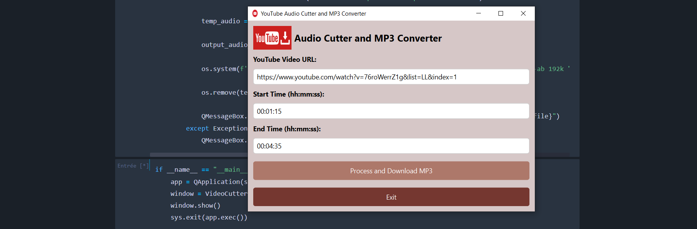
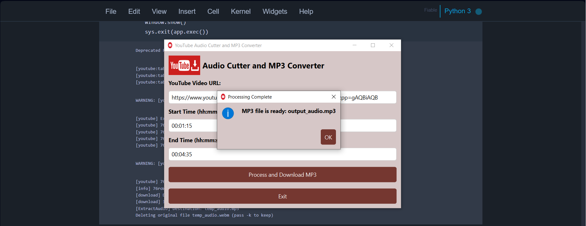

# Youtube_cut_videos  
Cut, edit, and download YouTube videos quickly and easily.

This application, built with Python and PyQt6, allows you to download audio from YouTube videos, cut it between two specific timestamps, and save it as an MP3 file.  
Users simply paste the YouTube URL, select the start and end times (hh:mm:ss), and process the audio.  
The program uses `yt_dlp` for downloading and `ffmpeg` for precise audio trimming.  
It also features a graphical interface with input validation to ensure accurate time ranges.  
Temporary files are removed automatically after processing.  
All processing is done locally for quick and secure usage.  

---

## Test Usage Screenshots

### Step 1 – Paste YouTube URL and choose times  

### Step 2 – Final MP3 file ready

### Warning 

